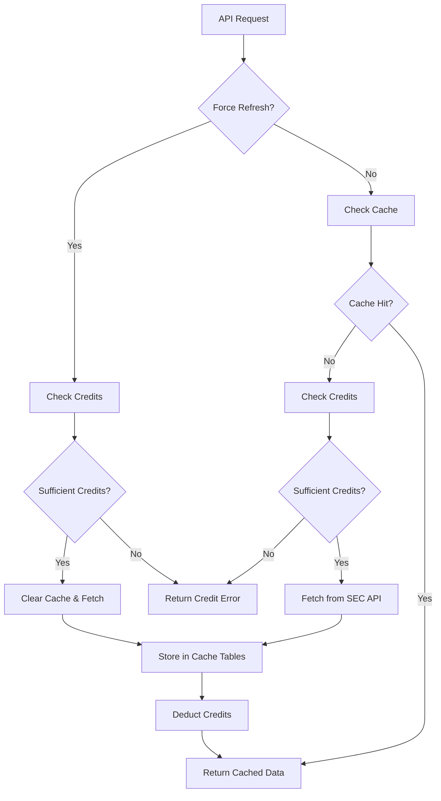

# SEC Filings Caching Implementation

## Overview

The SEC filings caching system has been redesigned to use PostgreSQL database tables instead of localStorage, providing user-specific caching with cross-device access, tier-based expiration, and credit integration.

## Architecture Changes

### Previous Implementation (localStorage)
- ❌ Client-side only storage
- ❌ Device-specific cache
- ❌ No user isolation
- ❌ Fixed expiration times
- ❌ Memory limitations

### Current Implementation (PostgreSQL)
- ✅ Server-side database storage
- ✅ Cross-device synchronization
- ✅ User-specific isolation
- ✅ Tier-based expiration
- ✅ Scalable storage
- ✅ Credit system integration

## Database Schema

### Core Tables
1. **`user_sec_cache`** - Main cache metadata and small payloads
2. **`user_sec_insider_trades`** - Optimized insider trading data storage
3. **`user_sec_institutional_holdings`** - 13F filings and institutional data

See [Database Schema Documentation](../../Data/user_sec_cache-postgres.md) for detailed table structures.

## Cache Service Architecture

### userSecCacheService.js

Located at: `backend/services/userSecCacheService.js`

```javascript
class UserSecCacheService {
  // Tier-based expiration times
  static getExpirationTime(tier) {
    const expirationTimes = {
      'free': 3600,        // 1 hour
      'pro': 21600,        // 6 hours  
      'elite': 43200,      // 12 hours
      'institutional': 86400 // 24 hours
    };
    return expirationTimes[tier] || expirationTimes.free;
  }

  // Generate cache key
  static generateCacheKey(dataType, timeRange, tier) {
    return `${dataType}_${timeRange}_${tier}_${Date.now()}`;
  }

  // Main cache management
  async getSecData(userId, dataType, timeRange, tier, forceRefresh = false)
  async clearUserCache(userId)
}
```

### Cache Flow



## API Integration

### Controller Updates

**secController.js** - Updated to use database caching:

```javascript
// Insider Trades
exports.getInsiderTrades = async (req, res) => {
  const { timeRange } = req.query;
  const userId = req.user?.id;
  const tier = req.user?.tier || 'free';
  
  try {
    const data = await userSecCacheService.getSecData(
      userId, 
      'insider_trades', 
      timeRange, 
      tier, 
      req.query.refresh === 'true'
    );
    
    res.json(data);
  } catch (error) {
    if (error.message.includes('INSUFFICIENT_CREDITS')) {
      return res.status(402).json({ error: error.message });
    }
    res.status(500).json({ error: error.message });
  }
};

// Institutional Holdings  
exports.getInstitutionalHoldings = async (req, res) => {
  // Similar implementation for institutional data
};

// Cache Management
exports.clearUserSecCache = async (req, res) => {
  const userId = req.user?.id;
  await userSecCacheService.clearUserCache(userId);
  res.json({ success: true });
};
```

### API Endpoints

```
GET  /api/sec/insider-trades?timeRange=1m&refresh=false
GET  /api/sec/institutional-holdings?timeRange=1m&refresh=false  
GET  /api/sec/insider-trades/stream?timeRange=1m&refresh=true
POST /api/sec/clear-user-cache
```

## Frontend Integration

### API Service Updates

**frontend/src/services/api.ts**:

```typescript
// Updated to use user cache system
export const fetchInsiderTradesWithUserCache = async (
  timeRange: TimeRange, 
  refresh: boolean = false
): Promise<InsiderTrade[]> => {
  const params = new URLSearchParams({
    timeRange,
    refresh: refresh.toString()
  });
  
  const response = await apiClient.get(`/sec/insider-trades?${params}`);
  return response.data;
};

export const clearUserSecCache = async (): Promise<void> => {
  await apiClient.post('/sec/clear-user-cache');
};
```

### Component Updates

**SECFilingsDashboard.tsx** - Removed localStorage dependencies:

```typescript
// REMOVED: localStorage state management
// const [data, setData] = useState(() => {
//   try {
//     const cached = localStorage.getItem('secFilings_data');
//     return cached ? JSON.parse(cached) : [];
//   } catch (e) {
//     return [];
//   }
// });

// NEW: Simple state management, server handles caching
const [insiderTradesData, setInsiderTradesData] = useState<any[]>([]);
const [institutionalHoldingsData, setInstitutionalHoldingsData] = useState<any[]>([]);

// Cache refresh now clears backend cache
const handleRefresh = async () => {
  try {
    await clearUserSecCache(); // Clear server-side cache
    // Trigger fresh data fetch
  } catch (error) {
    console.error('Error clearing cache:', error);
  }
};
```

## Cache Management Features

### Tier-Based Expiration

Cache expiration varies by user tier:

```javascript
const expirationTimes = {
  'free': 3600,        // 1 hour - encourages upgrades
  'pro': 21600,        // 6 hours - good balance
  'elite': 43200,      // 12 hours - premium experience
  'institutional': 86400 // 24 hours - enterprise level
};
```

### Credit Integration

```javascript
async function checkAndDeductCredits(userId, tier, dataType) {
  const creditCost = getCreditCost(dataType); // 10 credits for SEC data
  
  const userCredits = await getUserCredits(userId);
  if (userCredits < creditCost) {
    throw new Error('INSUFFICIENT_CREDITS');
  }
  
  await deductCredits(userId, creditCost, {
    service: 'sec_filings',
    data_type: dataType,
    tier: tier
  });
}
```

### Cross-Device Synchronization

Data is automatically synchronized across devices for the same user:

1. **User A** fetches insider trades on Desktop → Cached in database
2. **User A** opens mobile app → Same cached data served
3. **Cache expires** based on tier → Next request fetches fresh data

### Force Refresh Mechanism

```javascript
// Force refresh bypasses cache entirely
if (forceRefresh) {
  // Clear existing cache for this data type
  await this.clearCache(userId, dataType, timeRange);
  
  // Fetch fresh data from SEC API
  const freshData = await fetchFromSecAPI(dataType, timeRange);
  
  // Store in cache with new expiration
  await this.storeCache(userId, dataType, timeRange, tier, freshData);
  
  return freshData;
}
```

## Error Handling

### Credit Errors

```typescript
// Frontend error handling
catch (error) {
  if (error.message?.includes('credits') || error.message?.includes('INSUFFICIENT_CREDITS')) {
    setError('You need 10 credits to access SEC filings data. Please upgrade your plan or wait for credits to refresh.');
    return; // Don't retry on credit errors
  }
  setError(errorMessage);
}
```

### Cache Failures

```javascript
// Backend fallback to direct API
async getSecData(userId, dataType, timeRange, tier, forceRefresh = false) {
  try {
    // Try cache first
    if (!forceRefresh) {
      const cached = await this.checkCache(userId, dataType, timeRange);
      if (cached) return cached;
    }
    
    // Fetch fresh data
    return await this.fetchAndCache(userId, dataType, timeRange, tier);
    
  } catch (cacheError) {
    console.error('Cache error, falling back to direct API:', cacheError);
    
    // Fallback: direct API call without caching
    return await fetchFromSecAPI(dataType, timeRange);
  }
}
```

## Performance Optimizations

### Database Indexes

Optimized queries with strategic indexes:

```sql
-- User-specific queries
CREATE INDEX idx_user_sec_cache_user_id ON user_sec_cache(user_id);

-- Expiration cleanup
CREATE INDEX idx_user_sec_cache_expires_at ON user_sec_cache(expires_at);

-- Data type filtering  
CREATE INDEX idx_user_sec_cache_data_type ON user_sec_cache(data_type);

-- Ticker-based searches
CREATE INDEX idx_user_sec_insider_trades_ticker ON user_sec_insider_trades(ticker);
```

### Query Optimization

```javascript
// Efficient cache lookup
async checkCache(userId, dataType, timeRange) {
  const query = `
    SELECT cache_key, expires_at 
    FROM user_sec_cache 
    WHERE user_id = $1 
      AND data_type = $2 
      AND time_range = $3 
      AND expires_at > CURRENT_TIMESTAMP
    ORDER BY created_at DESC 
    LIMIT 1
  `;
  
  const result = await db.query(query, [userId, dataType, timeRange]);
  return result.rows[0];
}
```

### Memory Management

- **JSONB Storage**: Efficient storage for complex SEC data
- **Lazy Loading**: Data tables only queried when cache hit confirmed
- **Batch Operations**: Multiple cache entries processed in single transactions

## Monitoring & Analytics

### Cache Hit Rate Tracking

```javascript
// Track cache performance
async logCacheAccess(userId, dataType, cacheHit, tier) {
  await db.query(`
    INSERT INTO cache_analytics (user_id, data_type, cache_hit, tier, timestamp)
    VALUES ($1, $2, $3, $4, CURRENT_TIMESTAMP)
  `, [userId, dataType, cacheHit, tier]);
}
```

### Performance Metrics

- **Cache Hit Rate**: % of requests served from cache
- **Credit Efficiency**: Credits saved through caching
- **Response Times**: Database vs API fetch times
- **Storage Usage**: Cache table sizes and growth

## Migration from localStorage

### Breaking Changes

1. **No localStorage dependency** - All caching moved to backend
2. **Authentication required** - User must be logged in for caching
3. **Credit integration** - Failed credit checks prevent data access
4. **Tier-aware expiration** - Cache duration varies by user tier

### Backward Compatibility

The system gracefully handles users with existing localStorage data:

```typescript
// Frontend migration helper (temporary)
useEffect(() => {
  // Clear any existing localStorage SEC data
  localStorage.removeItem('secFilings_insiderTrades');
  localStorage.removeItem('secFilings_institutionalHoldings');
  localStorage.removeItem('secFilings_lastFetchTime');
}, []);
```

## Security Considerations

### User Data Isolation

- All cache queries include `user_id` filter
- No cross-user data access possible
- Cache keys include user-specific components

### Cache Poisoning Prevention

- Tier information embedded in cache keys
- Prevents tier escalation attacks
- Automatic expiration prevents stale privileged data

### Credit Validation

- Credits checked before expensive operations
- Prevents abuse of SEC API endpoints
- Audit trail for all credit transactions

## Future Enhancements

### Planned Features

1. **Cache Warming** - Preload popular data combinations
2. **Smart Expiration** - Adjust based on data freshness patterns
3. **Compression** - Reduce storage footprint for large datasets
4. **Regional Caching** - Geographic distribution for global users
5. **Cache Sharing** - Optional sharing between team members

### Performance Targets

- **Cache Hit Rate**: >80% for repeat requests
- **Response Time**: <200ms for cached data
- **Storage Efficiency**: <50MB per user average
- **Credit Savings**: 60%+ reduction in API costs

This new caching system provides a robust foundation for scalable SEC data access while maintaining excellent user experience across all tiers and devices.
