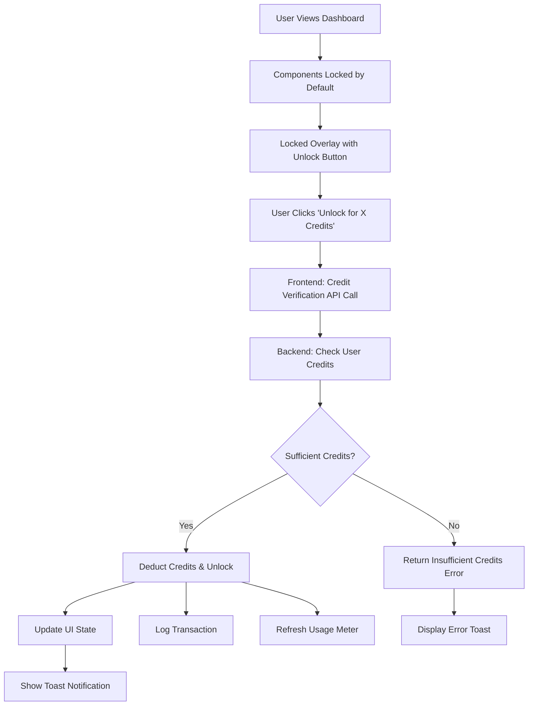

# Research Button & Content Gating Technical Implementation

## Overview

HRVSTR implements a sophisticated **component-level content gating system** that provides granular access control through credit-based unlocking. This technical document details how the research button mechanism works, including credit verification, content unlocking, and usage tracking integration.

## Architecture Overview



## Component Gating System

### Locked State Architecture

Each dashboard component implements a **conditional rendering pattern** based on unlock status:

```typescript
// Component-level gating
{unlockedComponents.sentimentChart ? (
  <SentimentChartCard {...props} />
) : (
  <LockedOverlay
    title="Market Sentiment Chart"
    description="Unlock real-time market sentiment timeline..."
    cost={COMPONENT_COSTS.sentimentChart}
    componentKey="sentimentChart"
    icon={<TrendingUp className="w-8 h-8 text-white" />}
  />
)}
```

### Locked Overlay Components

**Visual Design Principles:**
- Beautiful, non-aggressive presentation
- Clear value proposition
- Exact cost display before action
- Professional UI that builds trust

**Component Structure:**
```tsx
const LockedOverlay: React.FC<{
  title: string;
  description: string;
  cost: number;
  componentKey: keyof typeof unlockedComponents;
  icon: React.ReactNode;
}> = ({ title, description, cost, componentKey, icon }) => (
  <div className="locked-component-overlay">
    {/* Background pattern for visual appeal */}
    <div className="background-gradient-pattern" />
    
    {/* Content */}
    <div className="content-container">
      <div className="feature-icon">{icon}</div>
      <h3 className="feature-title">{title}</h3>
      <p className="feature-description">{description}</p>
      
      {/* Cost display */}
      <div className="cost-display">
        <Zap className="credit-icon" />
        <span>{cost} credits</span>
      </div>
      
      {/* Unlock button */}
      <button
        onClick={() => handleUnlockComponent(componentKey, cost)}
        className="unlock-button"
      >
        <Crown className="unlock-icon" />
        Unlock for {cost} Credits
      </button>
    </div>
  </div>
);
```

## Credit Verification Process

### Frontend Implementation

**Step 1: User Interaction**
```typescript
const handleUnlockComponent = async (
  component: keyof typeof unlockedComponents, 
  cost: number
) => {
  console.log(`🔓 Unlocking ${component} for ${cost} credits`);
  
  try {
    const response = await fetch(`${proxyUrl}/api/credits/unlock-component`, {
      method: 'POST',
      headers: {
        'Authorization': `Bearer ${token}`,
        'Content-Type': 'application/json',
      },
      body: JSON.stringify({ component, cost })
    });
    
    const data = await response.json();
    
    if (data.success) {
      // Success flow
      setUnlockedComponents(prev => ({
        ...prev,
        [component]: true
      }));
      
      info(`${cost} credits used`);
      window.dispatchEvent(new CustomEvent('tierRefresh'));
    } else {
      // Error handling
      info(`Failed to unlock: ${data.error}`);
    }
  } catch (error) {
    info('Error unlocking component');
  }
};
```

### Backend Verification Logic

**Step 1: Input Validation**
```javascript
// Validate request parameters
if (!component || !cost || cost <= 0) {
  return res.status(400).json({
    success: false,
    error: 'Invalid component or cost'
  });
}
```

**Step 2: Credit Balance Check**
```javascript
// Get current user credit status
const userResult = await pool.query(
  'SELECT tier, monthly_credits, credits_used, credits_purchased, credits_reset_date FROM users WHERE id = $1',
  [userId]
);

const user = userResult.rows[0];
const totalCredits = user.monthly_credits + (user.credits_purchased || 0);
const remainingCredits = totalCredits - user.credits_used;

// Verify sufficient credits
if (remainingCredits < cost) {
  return res.status(402).json({
    success: false,
    error: 'Insufficient credits',
    required: cost,
    remaining: remainingCredits
  });
}
```

**Step 3: Atomic Credit Deduction**
```javascript
const client = await pool.connect();

try {
  await client.query('BEGIN');
  
  // Deduct credits
  const result = await client.query(
    'UPDATE users SET credits_used = credits_used + $1 WHERE id = $2 RETURNING monthly_credits, credits_used, credits_purchased',
    [cost, userId]
  );
  
  // Log transaction
  await client.query(`
    INSERT INTO credit_transactions (
      user_id, action, credits_used, credits_remaining, metadata, created_at
    ) VALUES ($1, $2, $3, $4, $5, $6)
  `, [userId, `unlock_${component}`, cost, newRemainingCredits, metadata, new Date().toISOString()]);
  
  // Log activity
  await client.query(`
    INSERT INTO activities (user_id, activity_type, title, description)
    VALUES ($1, $2, $3, $4)
  `, [userId, 'component_unlock', `Unlocked ${component}`, `${cost} credits used to unlock ${component} component`]);
  
  await client.query('COMMIT');
} catch (error) {
  await client.query('ROLLBACK');
  throw error;
} finally {
  client.release();
}
```

## Usage Tracking Integration

### Real-Time Updates

**Frontend State Management:**
```typescript
// Component unlock state
const [unlockedComponents, setUnlockedComponents] = useState<{
  sentimentChart: boolean;
  sentimentScores: boolean;
  redditPosts: boolean;
}>({
  sentimentChart: false,
  sentimentScores: false,
  redditPosts: false,
});

// Trigger tier context refresh
window.dispatchEvent(new CustomEvent('tierRefresh'));
```

**Backend Integration:**
- Credit deduction updates `users.credits_used`
- Transaction logging in `credit_transactions` table
- Activity logging in `activities` table
- Automatic tier info refresh via `getUserTierInfo()`

### Usage Meter Synchronization

**TierContext Integration:**
```typescript
// Listen for tier refresh events
useEffect(() => {
  const handleTierRefresh = () => {
    refreshTierInfo();
  };

  window.addEventListener('tierRefresh', handleTierRefresh);
  return () => window.removeEventListener('tierRefresh', handleTierRefresh);
}, []);
```

**Usage Page Updates:**
The `/settings/usage` page reflects changes immediately because:
1. Credit deduction updates database instantly
2. TierContext refresh fetches latest data
3. Usage meter recalculates based on new `credits_used` value
4. Progress bars and counters update in real-time

## Security & Error Handling

### Security Measures

**Authentication:** All credit operations require valid JWT tokens
```javascript
router.post('/unlock-component', authenticateToken, async (req, res) => {
  // Authenticated user required
  const userId = req.user.id;
```

**Authorization:** Users can only unlock components for their own account
```javascript
// User ID from authenticated token - no cross-user access possible
const userResult = await pool.query(
  'SELECT ... FROM users WHERE id = $1',
  [userId] // From authenticated token only
);
```

**Transaction Integrity:** Database transactions ensure atomic operations
```javascript
await client.query('BEGIN');
try {
  // Multiple operations...
  await client.query('COMMIT');
} catch (error) {
  await client.query('ROLLBACK');
  throw error;
}
```

### Error Handling Scenarios

**Insufficient Credits:**
```json
{
  "success": false,
  "error": "Insufficient credits",
  "required": 8,
  "remaining": 3
}
```

**Invalid Component:**
```json
{
  "success": false,
  "error": "Invalid component or cost"
}
```

**Network/Database Errors:**
```json
{
  "success": false,
  "error": "Failed to unlock component"
}
```

**Frontend Error Handling:**
```typescript
if (data.success) {
  // Success: unlock component
} else {
  // Error: show user-friendly message
  info(`Failed to unlock: ${data.error}`);
}
```

## Component Cost Configuration

### Static Pricing Model

```typescript
const COMPONENT_COSTS = {
  sentimentChart: 8,    // Market sentiment timeline
  sentimentScores: 12,  // Individual ticker sentiment analysis
  redditPosts: 5,       // Reddit posts access
};
```

### Dynamic Pricing Considerations

**Future Enhancements:**
- **Tier-based discounts**: Automatic application in backend
- **Bundle pricing**: Multiple components for reduced total cost
- **Peak pricing**: Higher costs during market volatility
- **User-specific pricing**: Loyalty discounts for long-term users

## User Experience Flow

### Complete User Journey

1. **Initial View**: User sees dashboard with locked overlays
2. **Value Discovery**: Beautiful overlays show feature descriptions
3. **Cost Transparency**: Exact credit cost displayed prominently
4. **Decision Point**: User decides which components to unlock
5. **Instant Gratification**: Click unlock → immediate access
6. **Feedback Loop**: Toast notification confirms credit usage
7. **Persistent Access**: Component remains unlocked for session
8. **Usage Tracking**: Real-time meter updates at `/settings/usage`

### Session Management

**Component State Persistence:**
- Unlocked components remain available during browser session
- State resets on page refresh (intentional for credit management)
- Users can unlock different combinations per session
- No permanent unlocking - encourages thoughtful usage

## Performance Considerations

### Database Optimization

**Efficient Queries:**
```sql
-- Single query for user credit check
SELECT tier, monthly_credits, credits_used, credits_purchased, credits_reset_date 
FROM users 
WHERE id = $1;

-- Atomic credit deduction
UPDATE users 
SET credits_used = credits_used + $1 
WHERE id = $2 
RETURNING monthly_credits, credits_used, credits_purchased;
```

**Connection Pooling:**
- PostgreSQL connection pooling for efficient database access
- Transaction management with proper connection cleanup
- Error handling with connection release

### Frontend Optimization

**State Management:**
- Minimal re-renders with targeted state updates
- Efficient component gating with conditional rendering
- Toast notifications with debouncing

**API Efficiency:**
- Single API call per unlock operation
- Batch operations where possible
- Proper error boundaries

## Monitoring & Analytics

### Business Intelligence

**Key Metrics Tracked:**
- Component unlock rates by tier
- Credit efficiency (credits used vs. value derived)
- User session patterns and component combinations
- Revenue attribution per component

**Database Logging:**
```sql
-- Component unlock tracking
INSERT INTO activities (user_id, activity_type, title, description)
VALUES ($1, 'component_unlock', 'Unlocked sentimentChart', '8 credits used...');

-- Detailed transaction logging
INSERT INTO credit_transactions (user_id, action, credits_used, credits_remaining, metadata)
VALUES ($1, 'unlock_sentimentChart', 8, 492, '{"component": "sentimentChart", "tier": "pro"}');
```

### User Behavior Analytics

**Session Tracking:**
- Component unlock sequences
- Credit spending patterns
- Feature adoption rates
- Tier upgrade correlation with component usage

## Conclusion

HRVSTR's research button and content gating system represents a sophisticated implementation of granular access control. By combining beautiful UX with robust backend verification, we create a system that:

- **Respects User Agency**: Clear costs and immediate value
- **Ensures Fair Billing**: Accurate credit tracking and verification
- **Provides Transparency**: Real-time usage monitoring
- **Maintains Security**: Authenticated, authorized, atomic operations
- **Scales Effectively**: Efficient database operations and state management

This implementation sets a new standard for freemium content gating, moving beyond simple paywalls to create an engaging, transparent, and user-controlled experience. 