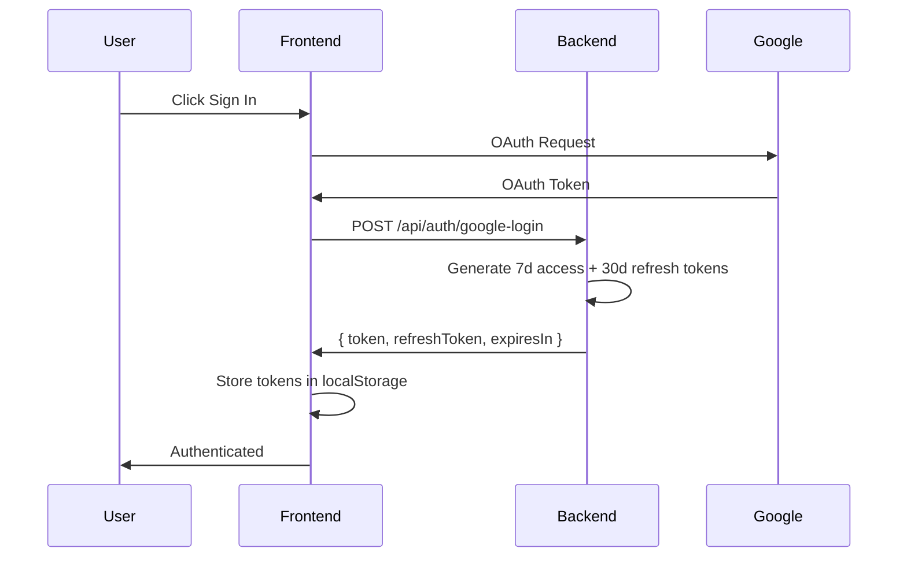
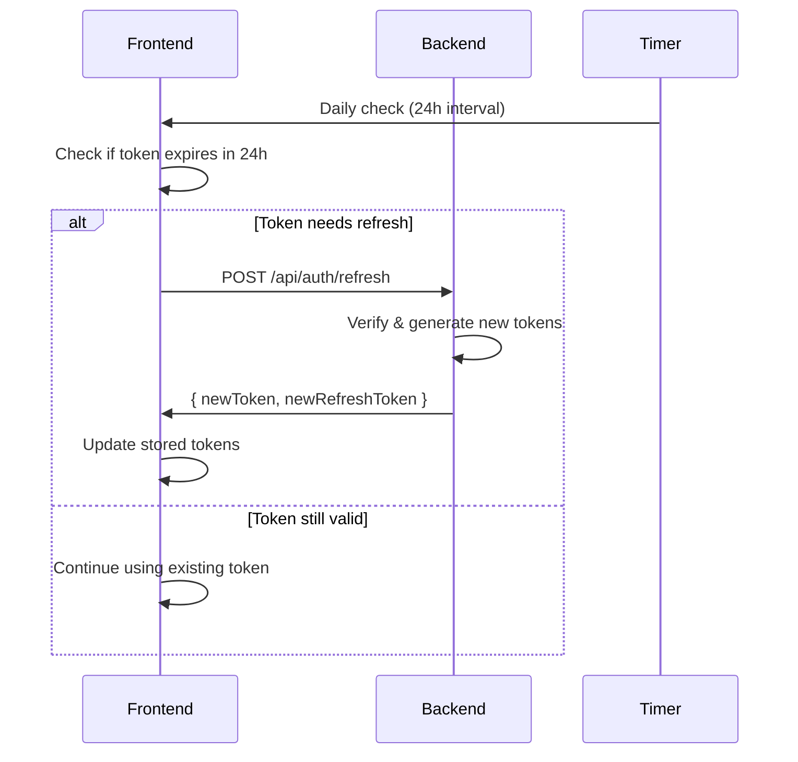
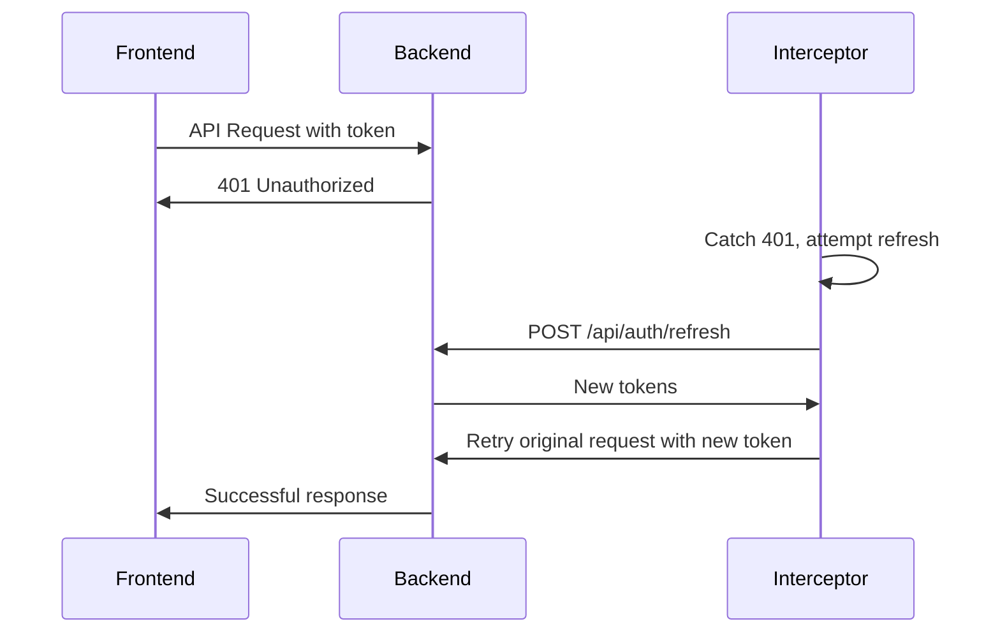

# HRVSTR Session Management & Authentication

## Overview

This document outlines the improved session management system for HRVSTR that addresses frequent re-authentication issues and provides a more robust user experience.

## Previous Issues

### Problems with Original System
- **Short Token Expiry**: Tokens expired in 1 hour, causing frequent logouts
- **Missing Refresh Endpoint**: Frontend attempted to call `/api/auth/refresh` but it didn't exist
- **Aggressive Refresh Checks**: Token validation every 30 minutes
- **No Refresh Token System**: Only access tokens without proper refresh mechanism
- **Poor Error Handling**: Limited graceful handling of token expiration

### User Experience Impact
- Users had to re-authenticate frequently
- Unexpected authorization errors during app usage
- Poor session persistence across browser sessions
- Inconsistent authentication state

## Improved Session Management

### New Token System

#### Access Tokens
- **Expiry**: 7 days (previously 1 hour)
- **Purpose**: Authenticate API requests
- **Storage**: `localStorage` with expiry tracking
- **Refresh**: Automatic when needed

#### Refresh Tokens
- **Expiry**: 30 days
- **Purpose**: Generate new access tokens
- **Storage**: `localStorage` (secure, HttpOnly cookies recommended for production)
- **Usage**: Automatic via interceptors

### Key Improvements

#### 1. Extended Token Lifetimes
```javascript
// Backend: auth.js
const generateTokens = (userId) => {
  const accessToken = jwt.sign({ userId }, process.env.JWT_SECRET, { expiresIn: '7d' });
  const refreshToken = jwt.sign({ userId, type: 'refresh' }, process.env.JWT_SECRET, { expiresIn: '30d' });
  return { accessToken, refreshToken };
};
```

#### 2. Robust Refresh Endpoint
```javascript
// POST /api/auth/refresh
router.post('/refresh', async (req, res) => {
  const { token } = req.body;
  
  try {
    // Verify token (allows expired access tokens)
    const decoded = jwt.verify(token, process.env.JWT_SECRET, { ignoreExpiration: true });
    
    // Generate new tokens
    const { accessToken, refreshToken } = generateTokens(decoded.userId);
    
    res.json({
      token: accessToken,
      refreshToken: refreshToken,
      expiresIn: 7 * 24 * 60 * 60, // 7 days
      user: userData
    });
  } catch (err) {
    return res.status(401).json({ message: 'Token refresh failed, please login again' });
  }
});
```

#### 3. Smart Refresh Logic
```javascript
// Frontend: AuthContext.tsx
const REFRESH_INTERVAL = 24 * 60 * 60 * 1000; // Check daily
const EXPIRATION_BUFFER = 24 * 60 * 60 * 1000; // Refresh 1 day before expiry

const checkAndRefreshToken = () => {
  const tokenExpiry = localStorage.getItem('token_expiry');
  const expiryTime = parseInt(tokenExpiry);
  
  // Refresh if token expires within buffer time
  if (Date.now() >= expiryTime - EXPIRATION_BUFFER) {
    refreshToken();
  }
};
```

#### 4. Automatic Token Refresh via Interceptors
```javascript
// Axios interceptor handles 401/403 errors automatically
axios.interceptors.response.use(
  (response) => response,
  async (error) => {
    if (error.response?.status === 401 && !originalRequest._retry) {
      originalRequest._retry = true;
      
      // Attempt refresh and retry original request
      const refreshResult = await refreshToken();
      if (refreshResult) {
        originalRequest.headers['Authorization'] = `Bearer ${newToken}`;
        return axios(originalRequest);
      }
    }
    return Promise.reject(error);
  }
);
```

## Configuration System

### Auth Configuration (`frontend/src/config/auth.ts`)
```typescript
export const AUTH_CONFIG = {
  // Token expiry times
  ACCESS_TOKEN_EXPIRY: 7 * 24 * 60 * 60 * 1000, // 7 days
  REFRESH_TOKEN_EXPIRY: 30 * 24 * 60 * 60 * 1000, // 30 days
  
  // Refresh intervals
  REFRESH_CHECK_INTERVAL: 24 * 60 * 60 * 1000, // Daily
  EXPIRATION_BUFFER: 24 * 60 * 60 * 1000, // 1 day buffer
  
  // Storage keys
  STORAGE_KEYS: {
    AUTH_TOKEN: 'auth_token',
    REFRESH_TOKEN: 'refresh_token',
    TOKEN_EXPIRY: 'token_expiry',
    USER_DATA: 'user'
  },
  
  // API endpoints
  ENDPOINTS: {
    GOOGLE_LOGIN: '/api/auth/google-login',
    REFRESH_TOKEN: '/api/auth/refresh',
    LOGOUT: '/api/auth/logout'
  }
};
```

### Token Manager Utility (`frontend/src/utils/tokenManager.ts`)
```typescript
export class TokenManager {
  static storeTokens(tokenData: TokenData): void
  static getStoredTokens(): { accessToken, refreshToken, expiryTime }
  static isAccessTokenValid(): boolean
  static shouldRefreshToken(): boolean
  static refreshAccessToken(): Promise<TokenData | null>
  static clearTokens(): void
  static getTokenStatus(): TokenStatus
  static autoRefreshIfNeeded(): Promise<boolean>
}
```

## Session Flow

### 1. Initial Authentication


### 2. Automatic Token Refresh


### 3. API Request with Auto-Refresh


## Session Storage Strategy

### Current Implementation (localStorage)
```typescript
// Storage locations
localStorage.setItem('auth_token', accessToken);
localStorage.setItem('refresh_token', refreshToken);
localStorage.setItem('token_expiry', expiryTime.toString());
localStorage.setItem('user', JSON.stringify(userData));
```

### Security Considerations
- **Current**: localStorage (persistent across browser sessions)
- **Recommended for Production**: HttpOnly cookies for refresh tokens
- **Access Tokens**: Can remain in localStorage for convenience

### Future Security Improvements
```typescript
// Recommended production setup
// 1. Store refresh tokens in HttpOnly cookies
res.cookie('refresh_token', refreshToken, {
  httpOnly: true,
  secure: true,
  sameSite: 'strict',
  maxAge: 30 * 24 * 60 * 60 * 1000 // 30 days
});

// 2. Store access tokens in memory or sessionStorage
sessionStorage.setItem('auth_token', accessToken);
```

## Benefits of New System

### User Experience
- **Longer Sessions**: 7-day access tokens vs 1-hour
- **Seamless Refresh**: Automatic token renewal
- **Fewer Interruptions**: Users rarely need to re-authenticate
- **Persistent Sessions**: Survives browser restarts

### Developer Experience
- **Centralized Configuration**: Easy to adjust token lifetimes
- **Utility Classes**: Reusable token management
- **Better Error Handling**: Graceful failure scenarios
- **Comprehensive Logging**: Debug authentication issues

### Security
- **Refresh Token Rotation**: New refresh tokens on each refresh
- **Automatic Cleanup**: Invalid tokens cleared automatically
- **Configurable Expiry**: Easy to adjust security vs UX balance

## Monitoring & Debugging

### Console Logging
```typescript
// Token operations are logged with prefixes
[TokenManager] Tokens stored. Expires in 604800 seconds
[TokenManager] Attempting to refresh access token...
[TokenManager] Access token refreshed successfully
[AuthContext] Token refreshed successfully
```

### Token Status Check
```typescript
// Debug current token status
const status = TokenManager.getTokenStatus();
console.log({
  isValid: status.isValid,
  shouldRefresh: status.shouldRefresh,
  expiresAt: status.expiresAt,
  timeUntilExpiry: status.timeUntilExpiry
});
```

### Browser DevTools Inspection
```javascript
// Check stored tokens in browser console
Object.keys(localStorage)
  .filter(key => key.includes('auth') || key.includes('token'))
  .forEach(key => console.log(key, localStorage.getItem(key)));
```

## Configuration Options

### Adjusting Token Lifetimes
```typescript
// In auth.ts config file
export const AUTH_CONFIG = {
  // Increase for longer sessions
  ACCESS_TOKEN_EXPIRY: 14 * 24 * 60 * 60 * 1000, // 14 days
  
  // Decrease for more security
  ACCESS_TOKEN_EXPIRY: 1 * 24 * 60 * 60 * 1000, // 1 day
  
  // Adjust refresh frequency
  REFRESH_CHECK_INTERVAL: 12 * 60 * 60 * 1000, // Every 12 hours
};
```

### Backend Token Configuration
```javascript
// In auth.js
const generateTokens = (userId) => {
  // Adjust these values as needed
  const accessToken = jwt.sign({ userId }, secret, { expiresIn: '14d' });
  const refreshToken = jwt.sign({ userId, type: 'refresh' }, secret, { expiresIn: '60d' });
  return { accessToken, refreshToken };
};
```

## Troubleshooting

### Common Issues

#### 1. "No refresh token available"
- **Cause**: User logged in before refresh token implementation
- **Solution**: User needs to log out and back in once

#### 2. "Token refresh failed"
- **Cause**: Refresh token expired or backend issues
- **Solution**: Forces re-authentication, normal behavior

#### 3. Frequent token refreshes
- **Cause**: System clock issues or misconfigured expiry times
- **Solution**: Check system time and AUTH_CONFIG values

### Debug Commands
```javascript
// Clear all auth data (force fresh login)
localStorage.removeItem('auth_token');
localStorage.removeItem('refresh_token');
localStorage.removeItem('token_expiry');
localStorage.removeItem('user');

// Force token refresh test
TokenManager.refreshAccessToken();

// Check token status
console.log(TokenManager.getTokenStatus());
```

## Migration from Old System

### For Existing Users
1. **Automatic**: Existing users will get new tokens on next login
2. **Manual**: Clear localStorage to force immediate upgrade
3. **Gradual**: Old tokens will expire, triggering new system

### Code Changes Required
- ✅ Backend refresh endpoint added
- ✅ Frontend AuthContext updated
- ✅ Token utilities created
- ✅ Configuration centralized

## Future Enhancements

### Planned Improvements
1. **HttpOnly Cookies**: Move refresh tokens to secure cookies
2. **Token Rotation**: Implement refresh token rotation
3. **Session Management UI**: Admin panel for session monitoring
4. **Device Tracking**: Track and manage multiple device sessions
5. **Suspicious Activity Detection**: Monitor for unusual authentication patterns

### Security Roadmap
1. **Phase 1**: Current implementation (localStorage)
2. **Phase 2**: HttpOnly cookies for refresh tokens
3. **Phase 3**: Short-lived access tokens with frequent refresh
4. **Phase 4**: Advanced session management with device tracking

This improved session management system provides a much better user experience while maintaining security best practices. Users should now experience significantly fewer authentication interruptions while using the HRVSTR application. 