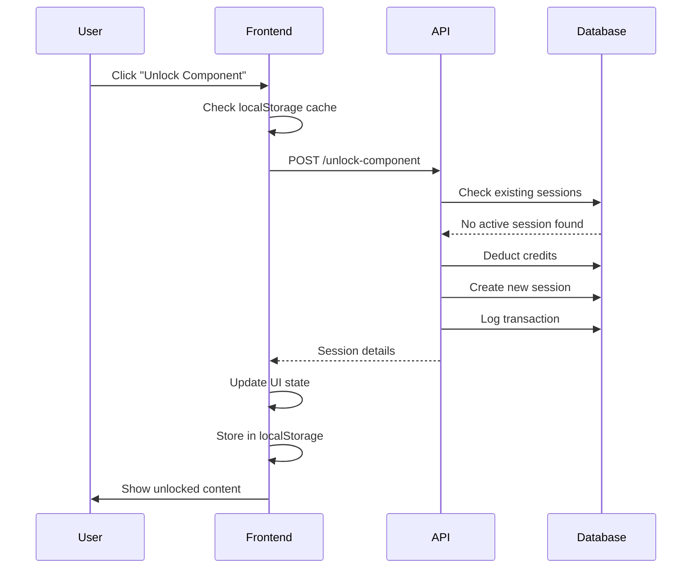
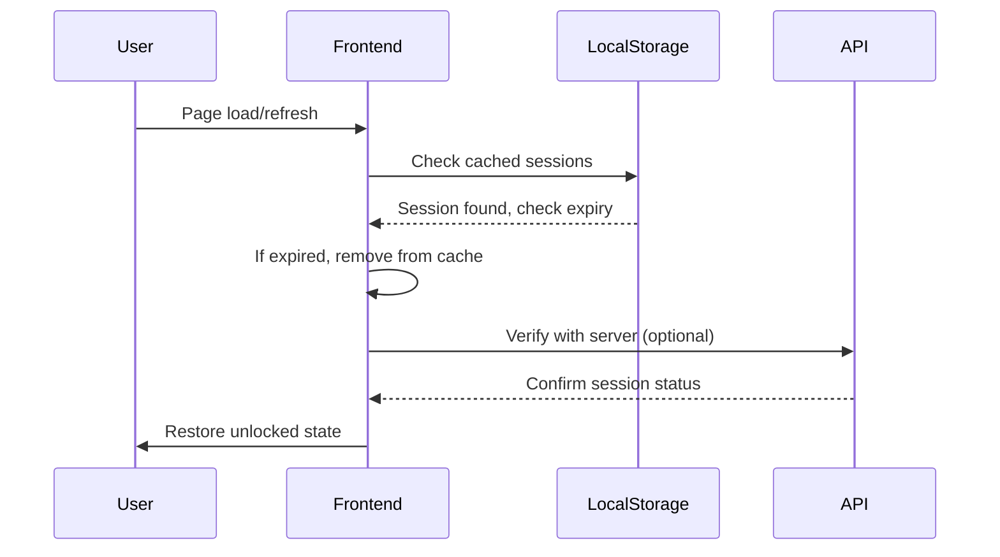
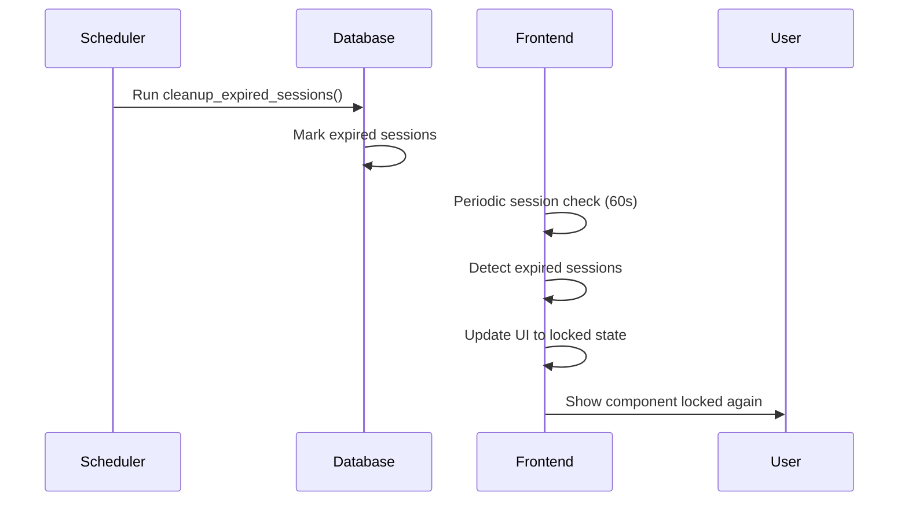

# Session-Based Component Unlock System - Technical Overview

## Architecture Summary

HRVSTR implements a sophisticated **dual-persistence session system** that combines database-backed authoritative sessions with client-side caching for optimal performance and reliability. This system enables component-level access control with automatic expiration management.

## System Components

### 1. Database Layer (`research_sessions` table)

```sql
CREATE TABLE research_sessions (
  id SERIAL PRIMARY KEY,
  user_id UUID NOT NULL REFERENCES users(id) ON DELETE CASCADE,
  session_id VARCHAR(255) UNIQUE NOT NULL,
  component VARCHAR(100) NOT NULL,
  credits_used INTEGER NOT NULL DEFAULT 0,
  unlocked_at TIMESTAMP DEFAULT CURRENT_TIMESTAMP,
  expires_at TIMESTAMP NOT NULL,
  status VARCHAR(20) DEFAULT 'active' CHECK (status IN ('active', 'expired', 'manual_end')),
  metadata JSONB DEFAULT '{}',
  created_at TIMESTAMP DEFAULT CURRENT_TIMESTAMP,
  updated_at TIMESTAMP DEFAULT CURRENT_TIMESTAMP
);
```

**Key Features:**
- **UUID Foreign Keys**: Compatible with existing user authentication system
- **Component Granularity**: Individual tracking per component (chart, scores, reddit)
- **Automatic Timestamps**: Track creation, updates, and expiration
- **Status Management**: Lifecycle tracking for sessions
- **Metadata Storage**: Flexible JSON for tier info, costs, debug data

### 2. Database Indexes

```sql
-- Efficient user + component lookups
CREATE INDEX idx_research_sessions_user_component 
ON research_sessions(user_id, component);

-- Cleanup and expiration queries
CREATE INDEX idx_research_sessions_status_expires 
ON research_sessions(status, expires_at);

-- Session ID lookups
CREATE INDEX idx_research_sessions_session_id 
ON research_sessions(session_id);
```

**Performance Benefits:**
- Sub-millisecond session verification
- Efficient cleanup operations
- Fast component access checks

### 3. Automatic Cleanup System

```sql
CREATE OR REPLACE FUNCTION cleanup_expired_sessions()
RETURNS INTEGER AS $$
DECLARE
    expired_count INTEGER;
BEGIN
    UPDATE research_sessions 
    SET status = 'expired' 
    WHERE status = 'active' 
    AND expires_at < CURRENT_TIMESTAMP;
    
    GET DIAGNOSTICS expired_count = ROW_COUNT;
    RETURN expired_count;
END;
$$ language 'plpgsql';
```

**Cleanup Strategy:**
- **Automatic Triggers**: Called on every session query
- **Background Processes**: Scheduled cleanup jobs (future enhancement)
- **Graceful Degradation**: Expired sessions marked, not deleted

## API Endpoints

### POST `/api/credits/unlock-component`

**Purpose**: Unlock a component with session persistence

**Request Body:**
```typescript
{
  component: 'chart' | 'scores' | 'reddit',
  cost: number,
  sessionDuration?: number  // Optional override
}
```

**Response Scenarios:**

#### New Unlock (Success)
```json
{
  "success": true,
  "message": "Successfully unlocked chart",
  "creditsUsed": 8,
  "creditsRemaining": 492,
  "component": "chart",
  "sessionId": "session_a947e2d3_chart_1735676543210",
  "expiresAt": "2024-12-31T16:30:43.210Z",
  "sessionDurationHours": 2.0,
  "existingSession": false
}
```

#### Existing Session (No Charge)
```json
{
  "success": true,
  "message": "Component already unlocked in active session",
  "creditsUsed": 0,
  "sessionId": "session_a947e2d3_chart_1735676543210",
  "expiresAt": "2024-12-31T16:30:43.210Z",
  "timeRemaining": 1.5,
  "existingSession": true
}
```

#### Insufficient Credits
```json
{
  "success": false,
  "error": "Insufficient credits",
  "required": 8,
  "remaining": 3
}
```

### GET `/api/credits/active-sessions`

**Purpose**: Retrieve user's current active sessions

**Response:**
```json
{
  "success": true,
  "activeSessions": [
    {
      "component": "chart",
      "session_id": "session_a947e2d3_chart_1735676543210",
      "expires_at": "2024-12-31T16:30:43.210Z",
      "credits_used": 8,
      "unlocked_at": "2024-12-31T14:30:43.210Z",
      "timeRemainingHours": 1.5,
      "isExpired": false
    }
  ]
}
```

## Frontend Implementation

### Session Storage Utilities (`sessionStorage.ts`)

```typescript
interface UnlockSession {
  unlocked: boolean;
  timestamp: number;
  expiresAt: number;
  sessionId: string;
  component: string;
  creditsUsed: number;
  tier: string;
}
```

**Key Functions:**
- `storeUnlockSession()`: Cache successful unlocks locally
- `checkUnlockSession()`: Verify active sessions with auto-cleanup
- `getAllUnlockSessions()`: Retrieve all active sessions
- `clearUnlockSession()`: Manual session cleanup

### Component Integration

#### Session Initialization
```typescript
useEffect(() => {
  const checkExistingSessions = () => {
    const chartSession = checkUnlockSession('chart');
    const scoresSession = checkUnlockSession('scores');
    const redditSession = checkUnlockSession('reddit');

    setUnlockedComponents({
      chart: !!chartSession,
      scores: !!scoresSession,
      reddit: !!redditSession
    });
  };

  checkExistingSessions();
  
  // Auto-refresh every minute to handle expiration
  const interval = setInterval(checkExistingSessions, 60000);
  return () => clearInterval(interval);
}, []);
```

#### Component Unlock Flow
```typescript
const handleUnlockComponent = async (component, cost) => {
  // 1. Check existing session first
  const existingSession = checkUnlockSession(component);
  if (existingSession) {
    const timeRemaining = getSessionTimeRemainingFormatted(existingSession);
    info(`${component} already unlocked (${timeRemaining})`);
    return;
  }
  
  // 2. Call API to unlock/verify
  const response = await fetch('/api/credits/unlock-component', {
    method: 'POST',
    headers: { 'Authorization': `Bearer ${token}` },
    body: JSON.stringify({ component, cost })
  });
  
  const data = await response.json();
  
  if (data.success) {
    // 3. Update UI state
    setUnlockedComponents(prev => ({ ...prev, [component]: true }));
    
    // 4. Store session locally
    storeUnlockSession(component, {
      sessionId: data.sessionId,
      expiresAt: data.expiresAt,
      creditsUsed: data.creditsUsed,
      tier: tierInfo?.tier || 'free'
    });
    
    // 5. Show user feedback
    info(`${data.creditsUsed} credits used`);
    
    // 6. Refresh tier info for usage meter
    await refreshTierInfo();
  }
};
```

## Session Lifecycle

### 1. Session Creation


### 2. Session Verification


### 3. Session Expiration


## Tier-Based Session Durations

```typescript
const tierSessionDurations = {
  free: 30 * 60 * 1000,        // 30 minutes
  pro: 2 * 60 * 60 * 1000,     // 2 hours
  elite: 4 * 60 * 60 * 1000,   // 4 hours
  institutional: 8 * 60 * 60 * 1000 // 8 hours
};
```

**Duration Rationale:**
- **Free (30m)**: Long enough for meaningful trial, short enough to encourage upgrades
- **Pro (2h)**: Typical research session duration for retail traders
- **Elite (4h)**: Extended analysis sessions for serious traders
- **Institutional (8h)**: Full trading day coverage for professional users

## Security Considerations

### 1. Server-Side Validation
- All session checks ultimately verified server-side
- LocalStorage used only for performance, not security
- Credit deductions always require server approval

### 2. Session Tampering Prevention
- Session IDs are server-generated UUIDs
- Expiration timestamps validated server-side
- Credit transactions logged immutably

### 3. Rate Limiting Protection
```typescript
// Prevent rapid unlock attempts
const unlockCooldown = new Map();

app.post('/unlock-component', (req, res) => {
  const userId = req.user.id;
  const lastUnlock = unlockCooldown.get(userId);
  
  if (lastUnlock && Date.now() - lastUnlock < 1000) {
    return res.status(429).json({ error: 'Too many requests' });
  }
  
  unlockCooldown.set(userId, Date.now());
  // ... continue with unlock logic
});
```

## Performance Optimizations

### 1. Dual Persistence Strategy
- **LocalStorage**: Instant UI state restoration
- **Database**: Authoritative source for billing/security
- **Hybrid Approach**: Best of both worlds

### 2. Efficient Queries
```sql
-- Single query for session verification
SELECT session_id, expires_at, credits_used 
FROM research_sessions 
WHERE user_id = $1 AND component = $2 
  AND status = 'active' AND expires_at > CURRENT_TIMESTAMP;
```

### 3. Batched Operations
```typescript
// Check all components at once
const sessions = await Promise.all([
  checkUnlockSession('chart'),
  checkUnlockSession('scores'), 
  checkUnlockSession('reddit')
]);
```

## Error Handling

### 1. Network Failures
```typescript
try {
  const response = await fetch('/unlock-component', ...);
  // Handle response
} catch (error) {
  // Graceful degradation
  console.error('Network error:', error);
  info('Network issue. Please try again.');
  
  // Don't charge user for failed requests
  // Don't remove existing sessions
}
```

### 2. Database Errors
```javascript
app.post('/unlock-component', async (req, res) => {
  const client = await pool.connect();
  
  try {
    await client.query('BEGIN');
    // ... session operations
    await client.query('COMMIT');
  } catch (error) {
    await client.query('ROLLBACK');
    console.error('Database error:', error);
    res.status(500).json({ 
      success: false, 
      error: 'System temporarily unavailable' 
    });
  } finally {
    client.release();
  }
});
```

### 3. Session Corruption
```typescript
const checkUnlockSession = (component: string): UnlockSession | null => {
  try {
    const stored = localStorage.getItem(`hrvstr_unlock_${component}`);
    if (!stored) return null;
    
    const data: UnlockSession = JSON.parse(stored);
    
    // Validate session structure
    if (!data.sessionId || !data.expiresAt) {
      throw new Error('Invalid session data');
    }
    
    return data;
  } catch (error) {
    console.error('Session corruption detected:', error);
    // Remove corrupted data
    localStorage.removeItem(`hrvstr_unlock_${component}`);
    return null;
  }
};
```

## Testing Strategy

### 1. Unit Tests
```typescript
describe('Session Storage', () => {
  test('stores and retrieves sessions correctly', () => {
    const sessionData = {
      sessionId: 'test-session-123',
      expiresAt: new Date(Date.now() + 3600000),
      creditsUsed: 8,
      tier: 'pro'
    };
    
    storeUnlockSession('chart', sessionData);
    const retrieved = checkUnlockSession('chart');
    
    expect(retrieved?.sessionId).toBe('test-session-123');
    expect(retrieved?.unlocked).toBe(true);
  });
  
  test('handles expired sessions', () => {
    const expiredSession = {
      sessionId: 'expired-session',
      expiresAt: new Date(Date.now() - 1000), // 1 second ago
      creditsUsed: 5,
      tier: 'free'
    };
    
    storeUnlockSession('reddit', expiredSession);
    const retrieved = checkUnlockSession('reddit');
    
    expect(retrieved).toBeNull();
  });
});
```

### 2. Integration Tests
```typescript
describe('API Integration', () => {
  test('unlock component creates session', async () => {
    const response = await request(app)
      .post('/api/credits/unlock-component')
      .set('Authorization', `Bearer ${validToken}`)
      .send({ component: 'chart', cost: 8 });
    
    expect(response.status).toBe(200);
    expect(response.body.success).toBe(true);
    expect(response.body.sessionId).toBeDefined();
    expect(response.body.creditsUsed).toBe(8);
  });
  
  test('existing session prevents double charging', async () => {
    // Create session
    await request(app)
      .post('/api/credits/unlock-component')
      .send({ component: 'scores', cost: 12 });
    
    // Try to unlock again
    const response = await request(app)
      .post('/api/credits/unlock-component')
      .send({ component: 'scores', cost: 12 });
    
    expect(response.body.creditsUsed).toBe(0);
    expect(response.body.existingSession).toBe(true);
  });
});
```

### 3. Load Testing
```typescript
// Simulate concurrent unlock attempts
const concurrentUnlocks = Array.from({ length: 100 }, (_, i) => 
  fetch('/api/credits/unlock-component', {
    method: 'POST',
    headers: { 'Authorization': `Bearer ${tokens[i]}` },
    body: JSON.stringify({ component: 'chart', cost: 8 })
  })
);

const responses = await Promise.all(concurrentUnlocks);
const successful = responses.filter(r => r.ok).length;

console.log(`${successful}/100 requests successful`);
```

## Monitoring & Analytics

### 1. Session Metrics
```sql
-- Session success rate
SELECT 
  COUNT(*) as total_sessions,
  COUNT(CASE WHEN status = 'active' THEN 1 END) as active_sessions,
  AVG(EXTRACT(EPOCH FROM (expires_at - created_at))/3600) as avg_duration_hours
FROM research_sessions 
WHERE created_at > NOW() - INTERVAL '24 hours';
```

### 2. Component Performance
```sql
-- Popular components by unlock frequency
SELECT 
  component,
  COUNT(*) as unlock_count,
  SUM(credits_used) as total_credits,
  AVG(credits_used) as avg_cost
FROM research_sessions 
GROUP BY component 
ORDER BY unlock_count DESC;
```

### 3. User Behavior
```sql
-- Session utilization by tier
SELECT 
  u.tier,
  AVG(EXTRACT(EPOCH FROM (rs.expires_at - rs.created_at))/3600) as avg_duration,
  COUNT(*) as session_count
FROM research_sessions rs
JOIN users u ON rs.user_id = u.id
GROUP BY u.tier;
```

## Future Enhancements

### 1. Smart Session Management
- **Usage-Based Extension**: Extend sessions for actively engaged users
- **Predictive Expiration**: ML models to optimize session lengths
- **Context-Aware Durations**: Different lengths for different analysis types

### 2. Cross-Device Synchronization
- **Device Linking**: Sessions accessible across user's devices
- **Real-Time Sync**: WebSocket updates for session state changes
- **Conflict Resolution**: Handle simultaneous access scenarios

### 3. Advanced Analytics
- **Session Heatmaps**: Visualize usage patterns
- **Optimization Recommendations**: Data-driven duration suggestions
- **A/B Testing Framework**: Experiment with different session models

---

## Conclusion

The session-based component unlock system represents a sophisticated balance of user experience, technical performance, and business requirements. By implementing dual persistence, automatic cleanup, and tier-based differentiation, we've created a robust foundation that can scale with HRVSTR's growth while maintaining the flexibility to evolve with changing user needs.

The system's success lies in its **invisible reliability** - users simply experience smooth, predictable access to premium features without worrying about the underlying complexity of session management, credit tracking, and automatic expiration handling. 